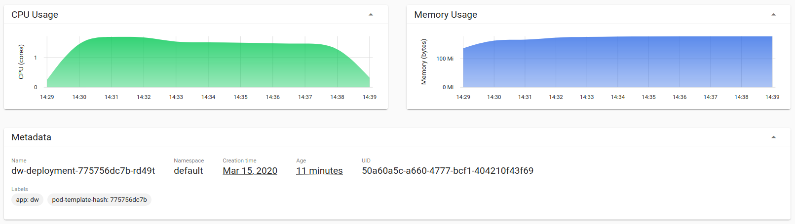
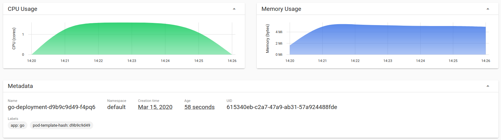
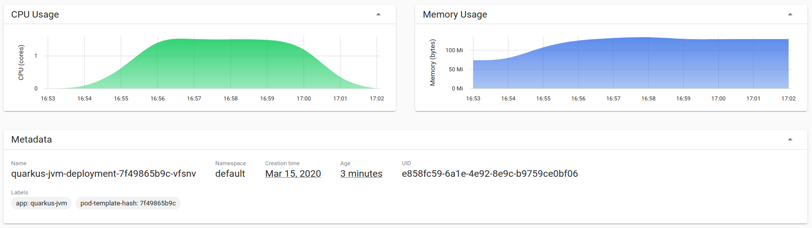
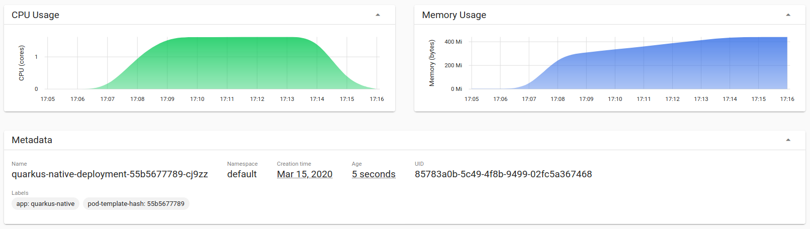
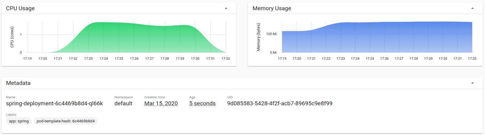

# Comparison of Java Web frameworks with Go
## Abstract

### Language and image versions used
All Java frameworks use Java 11 as compiler.
The Java frameworks dropwizard and spring-boot use the `openjdk:11-jre-slim-buster` docker image as base.

Quarkus is using `ubi8/ubi-minimal:8.1` from RedHat.

The Go implementation uses go 1.14 as compiler and use the `scratch` base image which is an empty image.

## create artifacts
There is a `build-all.sh` script file in the root of the project that compiles the source code and creates the docker images for each framework and for go. Please use your
docker hub account to store your images. If you try to build
the quarkus native image with the internal minikube docker deamon, you needs lots of RAM for minikube. If you use
docker hub as registry, 4GB of RAM for minikube is enough.

If you want to run them separate, you can proceed as follows:
#### dropwizard
    cd dropwizard
    mvn clean package
    docker build -t web-dropwizard:1.0 .
    docker run --rm -i -p 8080:8080 web-dropwizard:1.0

#### quarkus Java
    cd ../quarkus
    ./mvnw clean package
    docker build -f src/main/docker/Dockerfile.jvm -t web-quarkus-jvm:1.0 .
    docker run --rm -i -p 8080:8080 web-quarkus-jvm:1.0

#### quarkus native
    docker build -f src/main/docker/Dockerfile.multistage -t web-quarkus-native:1.0 .
    docker run --rm -i -p 8080:8080 web-quarkus-native:1.0

#### spring boot
    cd ../spring-boot
    mvn clean package
    docker build -t web-spring-boot:1.0 .
    docker run --rm -i -p 8080:8080 web-spring-boot:1.0

#### go
    cd ../go
    GOARCH=amd64 GOOS=linux CGO_ENABLED=0 go build -o web-go main.go
    docker build -t web-go:1.0 .
    docker run --rm -i -p 8080:8080 web-go:1.0

#### run apache benchmark
For each framework and for go, start the program as described and start the benchmark like this:

    docker run --rm -i -p 8080:8080 web-dw:1.0
    ab -n 30000 -c 16 -p ./post.data -T application/json http://localhost:8080/login
    ab -n 100000 -c 16 -p ./post.data -T application/json http://localhost:8080/login

The first benchmark is for the jvm to warm-up (jit compiler).

#### screenshots
Dropwizard

Go

Quarkus jvm

Quarkus native

Spring

## Results
The requests per second were measured using plain docker. The image size is what docker tells you
when you execute `docker image ls`. The RAM and CPU usage were measured with minikube
(see also the screenshots). Only one benchmark was running when the measurements took place.
The measurements on minkube (2.000.000 requests with go, 750.000 with java) didn't used a 
warmup phase, because I only wanted to measure CPU and RAM usage. There was only one
deployment active at a time to minimize side effects from other services.

| framework / language | image size MB | requests per s | RAM usage peak (MB) | CPU usage peak (cores) |
| :-----         | --: | --: | --: | --: |
| dropwizard     | 223 | 3044 | 179.00 | 1.72 |
| spring boot    | 222 | 3377 | 168.00 | 1.73 |
| quarkus jvm    | 351 | 4336 | 136.00 | 1.60 |
| quarkus native | 150 | 3762 | 441.00 | 1.62 |
| go             |  10 | 8219 |   5.69 | 1.59 |

All compilations and tests were done on a Lenovo Thinkpad T460 with Core i7-6600U CPU and 16GB of RAM.

## Conclusion
The CPU usage is roughly the same for all frameworks and for go. It's below 2, because the benchmark also needs
some cpu power.

The memory usage is for dropwizard, spring boot and quarkus jvm nearly the same, with a light advantage for quarkus jvm. Quarkus native is using more than three times what quarkus jvm is using. Go is using less than 1/20th of the best Java framework.

The image size is for the Java implementations around 200MB with a light advantage for quarkus native and a disadvantage for quarkus jvm. Go is also here only using 1/15th of the best Java solution.

The requests per second is for the java solutions around 3500 with a light disadvantage for dropwizard and an advantage for quarkus jvm. Again, go can nearly handle double as much of the best java solution.

I know, this is only a simple example. If somone else has a better use case, please fork this project and supply a merge request and I will try to add it.
